# 🗺️ ARCHITECTURE — Sơ đồ Page ↔ API ↔ Database

Tài liệu này vẽ luồng dữ liệu giữa **trang web (page)**, **API route** và
**bảng database** của project. Mermaid diagram được GitHub render trực tiếp.

---

## 1. Tổng quan luồng dữ liệu

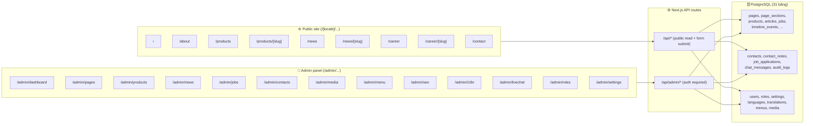
```mermaid
flowchart LR
    subgraph Public["🌐 Public site (/[locale]/...)"]
        Home["/"]
        About["/about"]
        Products["/products"]
        ProductDetail["/products/[slug]"]
        News["/news"]
        NewsDetail["/news/[slug]"]
        Career["/career"]
        JobDetail["/career/[slug]"]
        Contact["/contact"]
    end

    subgraph Admin["🔐 Admin panel (/admin/...)"]
        Dashboard["/admin/dashboard"]
        APages["/admin/pages"]
        AProducts["/admin/products"]
        ANews["/admin/news"]
        AJobs["/admin/jobs"]
        AContacts["/admin/contacts"]
        AMedia["/admin/media"]
        AMenu["/admin/menu"]
        ASeo["/admin/seo"]
        AI18n["/admin/i18n"]
        ALive["/admin/livechat"]
        ARoles["/admin/roles"]
        ASettings["/admin/settings"]
    end

    subgraph API["⚙️ Next.js API routes"]
        PubAPI["/api/* (public read + form submit)"]
        AdmAPI["/api/admin/* (auth required)"]
    end

    subgraph DB["🗄️ PostgreSQL (31 bảng)"]
        Content["pages, page_sections,<br/>products, articles, jobs,<br/>timeline_events, ..."]
        Tx["contacts, contact_notes,<br/>job_applications,<br/>chat_messages, audit_logs"]
        Sys["users, roles, settings,<br/>languages, translations,<br/>menus, media"]
    end

    Public --> PubAPI
    Admin --> AdmAPI
    PubAPI --> Content
    PubAPI --> Tx
    PubAPI --> Sys
    AdmAPI --> Content
    AdmAPI --> Tx
    AdmAPI --> Sys
```

---

## 2. ER Diagram — quan hệ giữa các bảng

> Chỉ vẽ quan hệ chính (FK) để dễ nhìn. Tên field i18n
> (`*_vi/_en/_zh`) được rút gọn.

### 2.1 Sản phẩm

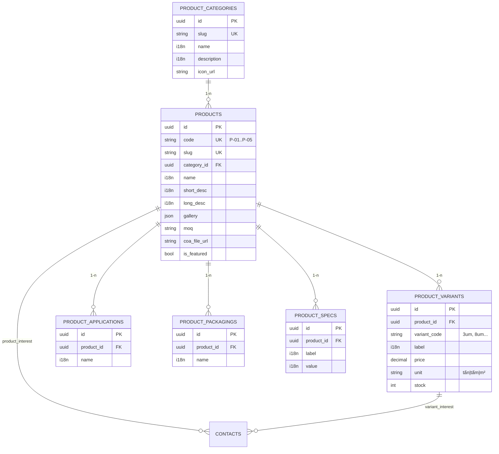
```mermaid
erDiagram
    PRODUCT_CATEGORIES ||--o{ PRODUCTS : "1-n"
    PRODUCTS ||--o{ PRODUCT_VARIANTS : "1-n"
    PRODUCTS ||--o{ PRODUCT_APPLICATIONS : "1-n"
    PRODUCTS ||--o{ PRODUCT_PACKAGINGS : "1-n"
    PRODUCTS ||--o{ PRODUCT_SPECS : "1-n"
    PRODUCTS ||--o{ CONTACTS : "product_interest"
    PRODUCT_VARIANTS ||--o{ CONTACTS : "variant_interest"

    PRODUCT_CATEGORIES {
        uuid id PK
        string slug UK
        i18n name
        i18n description
        string icon_url
    }
    PRODUCTS {
        uuid id PK
        string code UK "P-01..P-05"
        string slug UK
        uuid category_id FK
        i18n name
        i18n short_desc
        i18n long_desc
        json gallery
        string moq
        string coa_file_url
        bool is_featured
    }
    PRODUCT_VARIANTS {
        uuid id PK
        uuid product_id FK
        string variant_code "3um, 8um..."
        i18n label
        decimal price
        string unit "tấn|tấm|m²"
        int stock
    }
    PRODUCT_APPLICATIONS {
        uuid id PK
        uuid product_id FK
        i18n name
    }
    PRODUCT_PACKAGINGS {
        uuid id PK
        uuid product_id FK
        i18n name
    }
    PRODUCT_SPECS {
        uuid id PK
        uuid product_id FK
        i18n label
        i18n value
    }
```

### 2.2 Pages & CMS content

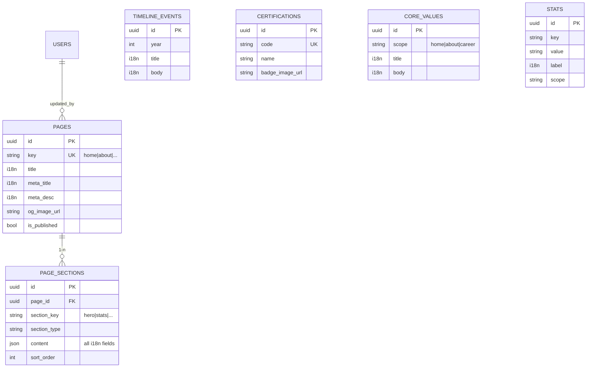
```mermaid
erDiagram
    PAGES ||--o{ PAGE_SECTIONS : "1-n"
    USERS ||--o{ PAGES : "updated_by"

    PAGES {
        uuid id PK
        string key UK "home|about|..."
        i18n title
        i18n meta_title
        i18n meta_desc
        string og_image_url
        bool is_published
    }
    PAGE_SECTIONS {
        uuid id PK
        uuid page_id FK
        string section_key "hero|stats|..."
        string section_type
        json content "all i18n fields"
        int sort_order
    }
    TIMELINE_EVENTS {
        uuid id PK
        int year
        i18n title
        i18n body
    }
    CERTIFICATIONS {
        uuid id PK
        string code UK
        string name
        string badge_image_url
    }
    CORE_VALUES {
        uuid id PK
        string scope "home|about|career"
        i18n title
        i18n body
    }
    STATS {
        uuid id PK
        string key
        string value
        i18n label
        string scope
    }
```

### 2.3 Tin tức

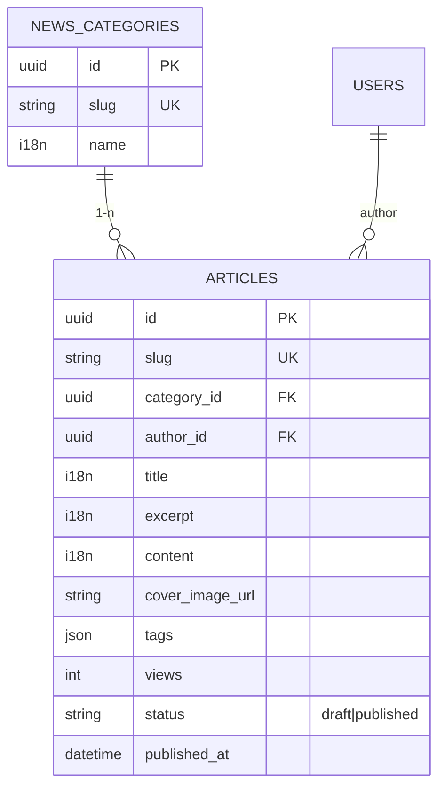
```mermaid
erDiagram
    NEWS_CATEGORIES ||--o{ ARTICLES : "1-n"
    USERS ||--o{ ARTICLES : "author"

    NEWS_CATEGORIES {
        uuid id PK
        string slug UK
        i18n name
    }
    ARTICLES {
        uuid id PK
        string slug UK
        uuid category_id FK
        uuid author_id FK
        i18n title
        i18n excerpt
        i18n content
        string cover_image_url
        json tags
        int views
        string status "draft|published"
        datetime published_at
    }
```

### 2.4 Tuyển dụng

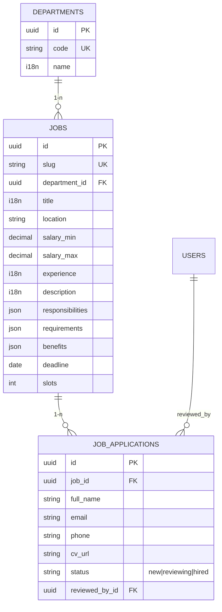
```mermaid
erDiagram
    DEPARTMENTS ||--o{ JOBS : "1-n"
    JOBS ||--o{ JOB_APPLICATIONS : "1-n"
    USERS ||--o{ JOB_APPLICATIONS : "reviewed_by"

    DEPARTMENTS {
        uuid id PK
        string code UK
        i18n name
    }
    JOBS {
        uuid id PK
        string slug UK
        uuid department_id FK
        i18n title
        string location
        decimal salary_min
        decimal salary_max
        i18n experience
        i18n description
        json responsibilities
        json requirements
        json benefits
        date deadline
        int slots
    }
    JOB_APPLICATIONS {
        uuid id PK
        uuid job_id FK
        string full_name
        string email
        string phone
        string cv_url
        string status "new|reviewing|hired"
        uuid reviewed_by_id FK
    }
```

### 2.5 Leads / CRM nhẹ

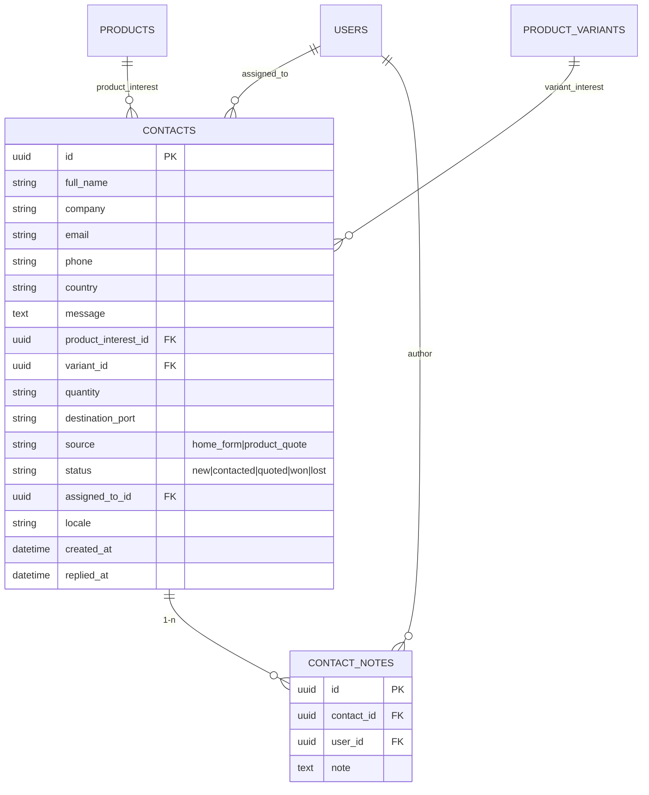
```mermaid
erDiagram
    CONTACTS ||--o{ CONTACT_NOTES : "1-n"
    USERS ||--o{ CONTACTS : "assigned_to"
    USERS ||--o{ CONTACT_NOTES : "author"
    PRODUCTS ||--o{ CONTACTS : "product_interest"
    PRODUCT_VARIANTS ||--o{ CONTACTS : "variant_interest"

    CONTACTS {
        uuid id PK
        string full_name
        string company
        string email
        string phone
        string country
        text message
        uuid product_interest_id FK
        uuid variant_id FK
        string quantity
        string destination_port
        string source "home_form|product_quote"
        string status "new|contacted|quoted|won|lost"
        uuid assigned_to_id FK
        string locale
        datetime created_at
        datetime replied_at
    }
    CONTACT_NOTES {
        uuid id PK
        uuid contact_id FK
        uuid user_id FK
        text note
    }
```

### 2.6 Hệ thống — Users / Roles / Settings / Audit

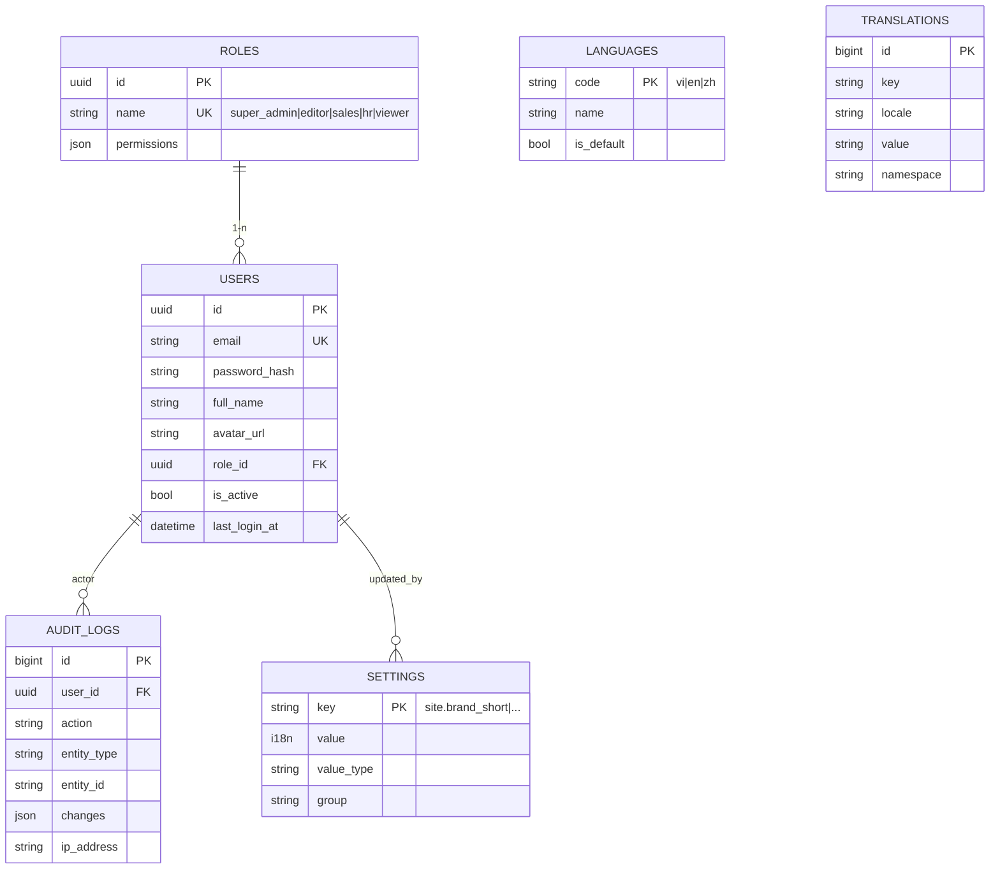
```mermaid
erDiagram
    ROLES ||--o{ USERS : "1-n"
    USERS ||--o{ AUDIT_LOGS : "actor"
    USERS ||--o{ SETTINGS : "updated_by"

    ROLES {
        uuid id PK
        string name UK "super_admin|editor|sales|hr|viewer"
        json permissions
    }
    USERS {
        uuid id PK
        string email UK
        string password_hash
        string full_name
        string avatar_url
        uuid role_id FK
        bool is_active
        datetime last_login_at
    }
    SETTINGS {
        string key PK "site.brand_short|..."
        i18n value
        string value_type
        string group
    }
    AUDIT_LOGS {
        bigint id PK
        uuid user_id FK
        string action
        string entity_type
        string entity_id
        json changes
        string ip_address
    }
    LANGUAGES {
        string code PK "vi|en|zh"
        string name
        bool is_default
    }
    TRANSLATIONS {
        bigint id PK
        string key
        string locale
        string value
        string namespace
    }
```

### 2.7 Media + Menu + Chat

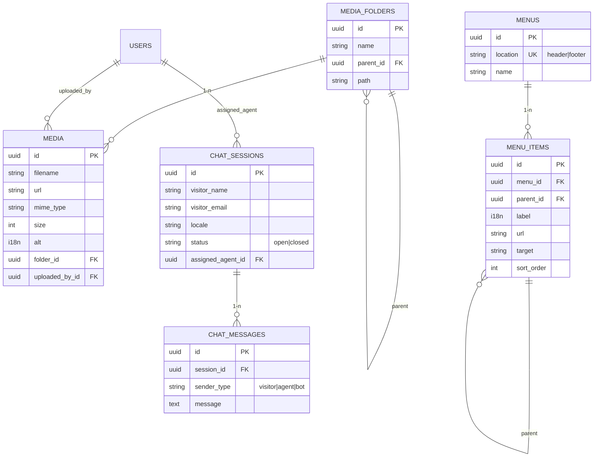
```mermaid
erDiagram
    MEDIA_FOLDERS ||--o{ MEDIA_FOLDERS : "parent"
    MEDIA_FOLDERS ||--o{ MEDIA : "1-n"
    USERS ||--o{ MEDIA : "uploaded_by"
    MENUS ||--o{ MENU_ITEMS : "1-n"
    MENU_ITEMS ||--o{ MENU_ITEMS : "parent"
    CHAT_SESSIONS ||--o{ CHAT_MESSAGES : "1-n"
    USERS ||--o{ CHAT_SESSIONS : "assigned_agent"

    MEDIA_FOLDERS {
        uuid id PK
        string name
        uuid parent_id FK
        string path
    }
    MEDIA {
        uuid id PK
        string filename
        string url
        string mime_type
        int size
        i18n alt
        uuid folder_id FK
        uuid uploaded_by_id FK
    }
    MENUS {
        uuid id PK
        string location UK "header|footer"
        string name
    }
    MENU_ITEMS {
        uuid id PK
        uuid menu_id FK
        uuid parent_id FK
        i18n label
        string url
        string target
        int sort_order
    }
    CHAT_SESSIONS {
        uuid id PK
        string visitor_name
        string visitor_email
        string locale
        string status "open|closed"
        uuid assigned_agent_id FK
    }
    CHAT_MESSAGES {
        uuid id PK
        uuid session_id FK
        string sender_type "visitor|agent|bot"
        text message
    }
```

---

## 3. PUBLIC SITE — Page ↔ API ↔ Tables

> Layout chung (Header / Footer / LanguageSwitcher) trên mọi page đọc:
> `settings`, `languages`, `menus` + `menu_items`, `translations`.

### 3.1 Trang chủ — `/[locale]/`

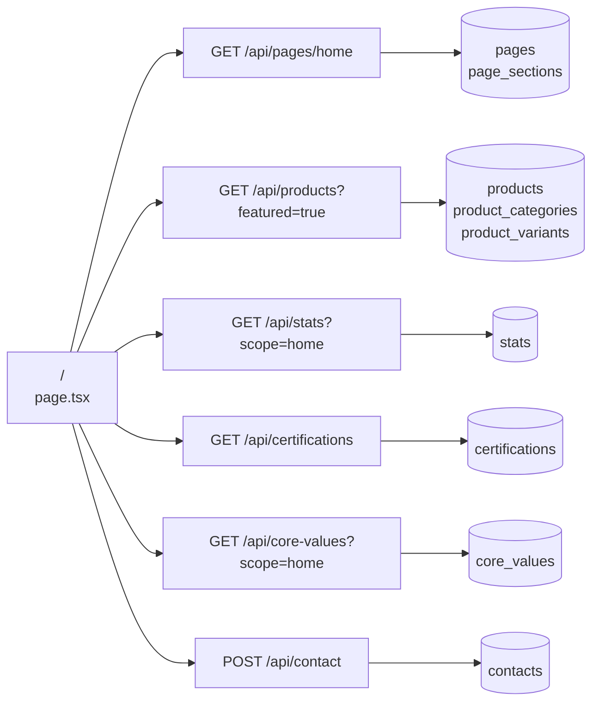
```mermaid
flowchart LR
    P["/<br/>page.tsx"] --> A1["GET /api/pages/home"]
    P --> A2["GET /api/products?featured=true"]
    P --> A3["GET /api/stats?scope=home"]
    P --> A4["GET /api/certifications"]
    P --> A5["GET /api/core-values?scope=home"]
    P --> A6["POST /api/contact"]

    A1 --> T1[("pages<br/>page_sections")]
    A2 --> T2[("products<br/>product_categories<br/>product_variants")]
    A3 --> T3[("stats")]
    A4 --> T4[("certifications")]
    A5 --> T5[("core_values")]
    A6 --> T6[("contacts")]
```

| Section trên trang     | API                                | Bảng đọc/ghi                                   |
| ---------------------- | ---------------------------------- | ---------------------------------------------- |
| Hero, intro, sections  | `GET /api/pages/home`              | `pages`, `page_sections`                       |
| Stats strip            | `GET /api/stats?scope=home`        | `stats`                                        |
| Products carousel      | `GET /api/products?featured=true`  | `products`, `product_categories`               |
| About 5 capability     | `GET /api/pages/home` (sections)   | `page_sections`                                |
| Certifications grid    | `GET /api/certifications`          | `certifications`                               |
| Export map / markets   | `GET /api/pages/home` (sections)   | `page_sections` (json)                         |
| Contact form           | `POST /api/contact`                | `contacts` (write) + email send                |

### 3.2 Giới thiệu — `/[locale]/about`

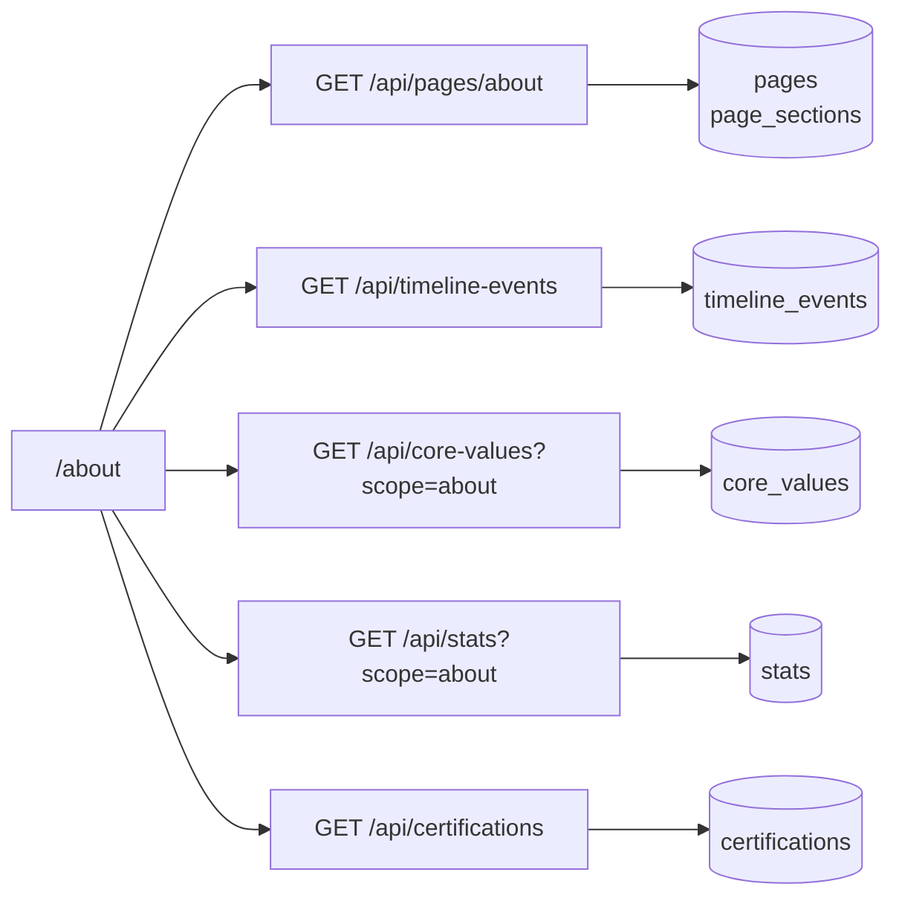
```mermaid
flowchart LR
    P["/about"] --> A1["GET /api/pages/about"]
    P --> A2["GET /api/timeline-events"]
    P --> A3["GET /api/core-values?scope=about"]
    P --> A4["GET /api/stats?scope=about"]
    P --> A5["GET /api/certifications"]

    A1 --> T1[("pages<br/>page_sections")]
    A2 --> T2[("timeline_events")]
    A3 --> T3[("core_values")]
    A4 --> T4[("stats")]
    A5 --> T5[("certifications")]
```

| Section          | API                                | Bảng                          |
| ---------------- | ---------------------------------- | ----------------------------- |
| Page header, CTA | `GET /api/pages/about`             | `pages`, `page_sections`      |
| Timeline 5 mốc   | `GET /api/timeline-events`         | `timeline_events`             |
| 3 giá trị cốt lõi | `GET /api/core-values?scope=about` | `core_values`                 |
| 6 capability rows | `GET /api/stats?scope=about`       | `stats`                       |
| Warehouse, certs | `GET /api/certifications`          | `certifications`              |

### 3.3 Sản phẩm — `/[locale]/products`

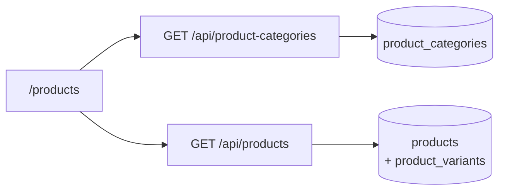
```mermaid
flowchart LR
    P["/products"] --> A1["GET /api/product-categories"]
    P --> A2["GET /api/products"]

    A1 --> T1[("product_categories")]
    A2 --> T2[("products<br/>+ product_variants")]
```

| Section            | API                          | Bảng                                       |
| ------------------ | ---------------------------- | ------------------------------------------ |
| Category tiles     | `GET /api/product-categories` | `product_categories`                       |
| Stats strip 4 ô    | `GET /api/stats?scope=product` | `stats`                                    |
| Product cards      | `GET /api/products`          | `products`, `product_variants` (min price) |
| CTA quote          | (link `/contact`)             | —                                          |

### 3.4 Chi tiết sản phẩm — `/[locale]/products/[slug]`

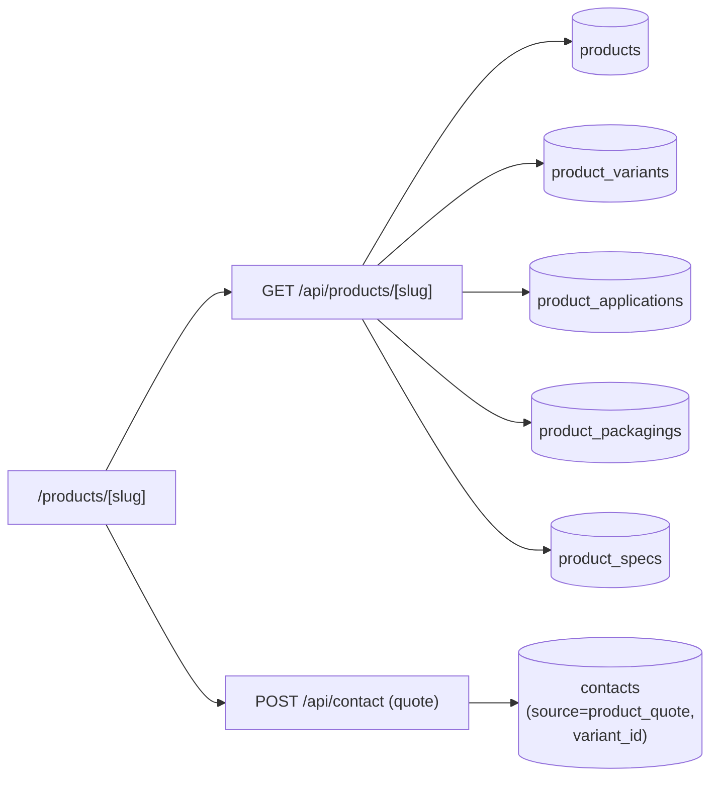
```mermaid
flowchart LR
    P["/products/[slug]"] --> A1["GET /api/products/[slug]"]
    P --> A2["POST /api/contact (quote)"]

    A1 --> T1[("products")]
    A1 --> T2[("product_variants")]
    A1 --> T3[("product_applications")]
    A1 --> T4[("product_packagings")]
    A1 --> T5[("product_specs")]
    A2 --> T6[("contacts<br/>(source=product_quote,<br/> variant_id)")]
```

| Section                 | API                              | Bảng                       |
| ----------------------- | -------------------------------- | -------------------------- |
| Tên + mô tả + gallery   | `GET /api/products/[slug]`       | `products`                 |
| Variants picker         | (lấy kèm)                        | `product_variants`         |
| Ứng dụng (6 cards)      | (lấy kèm)                        | `product_applications`     |
| Đóng gói (4 cards)      | (lấy kèm)                        | `product_packagings`       |
| Thông số kỹ thuật       | (lấy kèm)                        | `product_specs`            |
| Tải COA / MSDS          | (link tới `coa_file_url`)        | `media` (file gốc)         |
| Form "Yêu cầu báo giá"  | `POST /api/contact`              | `contacts` (write)         |

### 3.5 Tin tức — `/[locale]/news` + `/[locale]/news/[slug]`

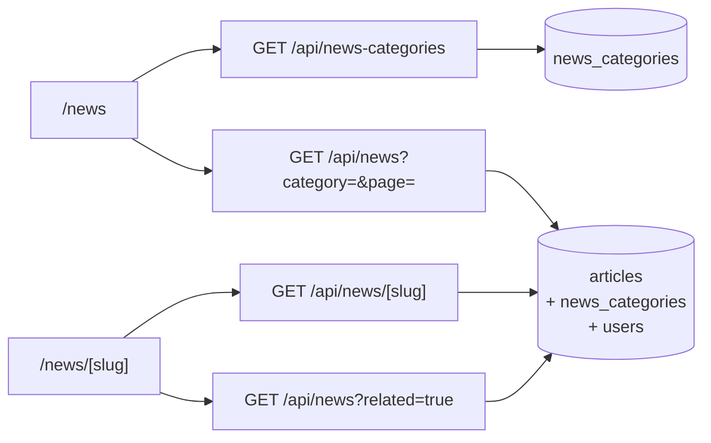
```mermaid
flowchart LR
    L["/news"] --> A1["GET /api/news-categories"]
    L --> A2["GET /api/news?category=&page="]
    D["/news/[slug]"] --> A3["GET /api/news/[slug]"]
    D --> A4["GET /api/news?related=true"]

    A1 --> T1[("news_categories")]
    A2 --> T2[("articles<br/>+ news_categories<br/>+ users")]
    A3 --> T2
    A4 --> T2
```

| Page                | API                                | Bảng                                   |
| ------------------- | ---------------------------------- | -------------------------------------- |
| `/news` list        | `GET /api/news`                    | `articles`, `news_categories`, `users` |
| `/news` filter      | `GET /api/news-categories`         | `news_categories`                      |
| `/news/[slug]`      | `GET /api/news/[slug]`             | `articles`, `users` (author)           |
| Related articles    | `GET /api/news?related=&category=` | `articles`                             |

### 3.6 Tuyển dụng — `/[locale]/career` + `/[locale]/career/[slug]`

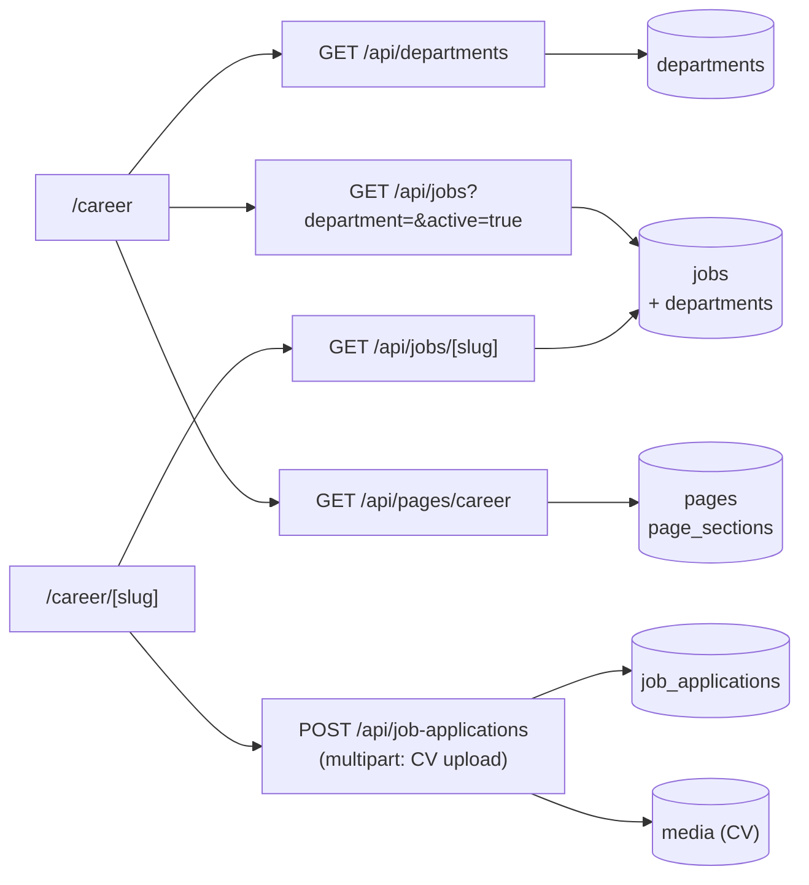
```mermaid
flowchart LR
    L["/career"] --> A1["GET /api/departments"]
    L --> A2["GET /api/jobs?department=&active=true"]
    L --> A3["GET /api/pages/career"]
    D["/career/[slug]"] --> A4["GET /api/jobs/[slug]"]
    D --> A5["POST /api/job-applications<br/>(multipart: CV upload)"]

    A1 --> T1[("departments")]
    A2 --> T2[("jobs<br/>+ departments")]
    A3 --> T3[("pages<br/>page_sections")]
    A4 --> T2
    A5 --> T4[("job_applications")]
    A5 --> T5[("media (CV)")]
```

| Page                  | API                                | Bảng                              |
| --------------------- | ---------------------------------- | --------------------------------- |
| `/career` hero/values | `GET /api/pages/career`            | `pages`, `page_sections`          |
| Filter department     | `GET /api/departments`             | `departments`                     |
| Job list              | `GET /api/jobs`                    | `jobs`, `departments`             |
| Job detail            | `GET /api/jobs/[slug]`             | `jobs`                            |
| Nộp đơn ứng tuyển     | `POST /api/job-applications`       | `job_applications`, `media` (CV)  |

### 3.7 Liên hệ — `/[locale]/contact`

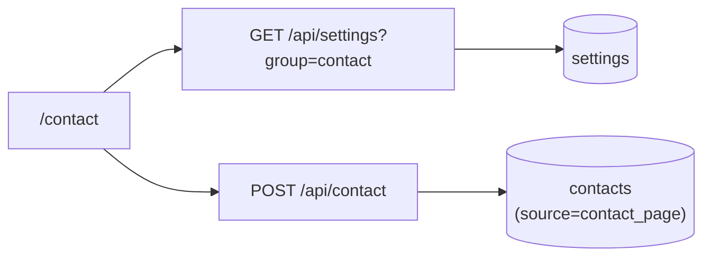
```mermaid
flowchart LR
    P["/contact"] --> A1["GET /api/settings?group=contact"]
    P --> A2["POST /api/contact"]

    A1 --> T1[("settings")]
    A2 --> T2[("contacts<br/>(source=contact_page)")]
```

| Section            | API                                | Bảng                           |
| ------------------ | ---------------------------------- | ------------------------------ |
| Address, phone… | `GET /api/settings?group=contact`  | `settings`                     |
| Form liên hệ       | `POST /api/contact`                | `contacts` (write) + email     |

---

## 4. ADMIN PANEL — Page ↔ API ↔ Tables

> Mọi route admin yêu cầu auth + middleware kiểm permissions từ `roles.permissions`.
> Mọi thao tác mutate đều ghi `audit_logs`.

| Admin page             | API endpoint                             | Bảng chính                                                  |
| ---------------------- | ---------------------------------------- | ----------------------------------------------------------- |
| `/admin/login`         | `POST /api/auth/callback/credentials`    | `users`, `roles` (NextAuth)                                 |
| `/admin/dashboard`     | `GET /api/admin/stats`                   | (aggregate) `contacts`, `articles`, `products`, `jobs`, `job_applications`, `chat_sessions` |
| `/admin/pages`         | `GET/PUT /api/admin/pages`               | `pages`                                                     |
| `/admin/pages/[key]`   | `GET/PUT /api/admin/pages/[key]/sections`| `page_sections`                                             |
| `/admin/products`      | `GET/POST /api/admin/products`           | `products`, `product_categories`                            |
| `/admin/products/[id]` | `PUT/DELETE /api/admin/products/[id]`    | `products`, `product_variants`, `product_applications`, `product_packagings`, `product_specs` |
| `/admin/news`          | `GET/POST /api/admin/articles`           | `articles`, `news_categories`                               |
| `/admin/news/[id]`     | `PUT/DELETE /api/admin/articles/[id]`    | `articles`                                                  |
| `/admin/jobs`          | `GET/POST /api/admin/jobs`               | `jobs`, `departments`                                       |
| `/admin/jobs/[id]`     | `PUT /api/admin/jobs/[id]`, `GET /api/admin/jobs/[id]/applications` | `jobs`, `job_applications`           |
| `/admin/contacts`      | `GET/PUT /api/admin/contacts`            | `contacts`, `contact_notes`                                 |
| `/admin/media`         | `GET/POST/DELETE /api/admin/media`       | `media`, `media_folders` + S3 upload                        |
| `/admin/menu`          | `GET/PUT /api/admin/menus`               | `menus`, `menu_items`                                       |
| `/admin/seo`           | `GET/PUT /api/admin/seo`                 | `settings` (group=seo), `pages` (meta fields)               |
| `/admin/i18n`          | `GET/PUT /api/admin/translations`        | `translations`, `languages`                                 |
| `/admin/livechat`      | `GET /api/admin/chat-sessions`, `WS /api/chat` | `chat_sessions`, `chat_messages`                       |
| `/admin/roles`         | `GET/POST/PUT /api/admin/roles`, `/api/admin/users` | `roles`, `users`                                |
| `/admin/settings`      | `GET/PUT /api/admin/settings`            | `settings`                                                  |

### Admin write → invalidate cache

Mọi `PUT/POST/DELETE` ở admin gọi `revalidatePath('/[locale]/...')` (Next.js
on-demand revalidation) để public page hiện đổi ngay sau khi admin save.

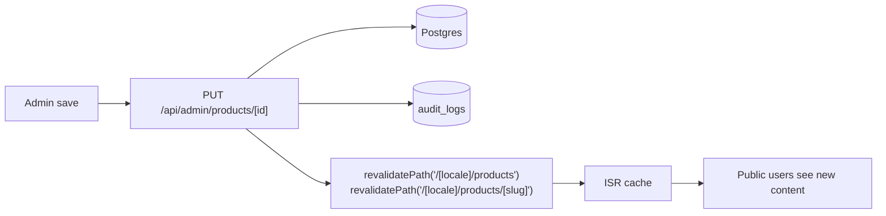
```mermaid
flowchart LR
    Adm[Admin save] --> AdmAPI["PUT /api/admin/products/[id]"]
    AdmAPI --> DB[(Postgres)]
    AdmAPI --> Audit[(audit_logs)]
    AdmAPI --> Rev["revalidatePath('/[locale]/products')<br/>revalidatePath('/[locale]/products/[slug]')"]
    Rev --> Cache[ISR cache]
    Cache --> Pub[Public users see new content]
```

---

## 5. Form / mutation flow chi tiết

### 5.1 Submit "Yêu cầu báo giá" từ trang sản phẩm

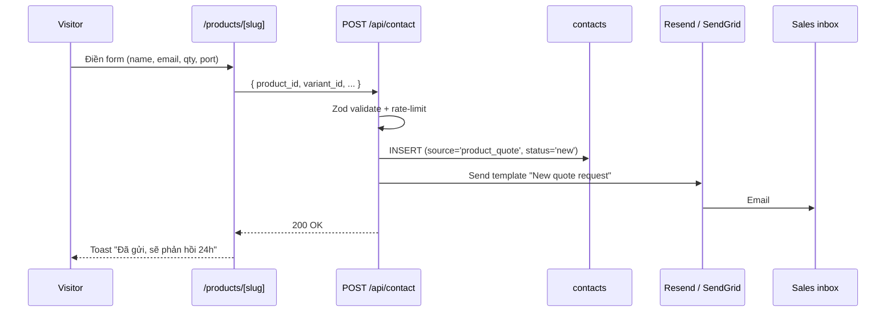
```mermaid
sequenceDiagram
    participant U as Visitor
    participant Page as /products/[slug]
    participant API as POST /api/contact
    participant DB as contacts
    participant Mail as Resend / SendGrid
    participant Sales as Sales inbox

    U->>Page: Điền form (name, email, qty, port)
    Page->>API: { product_id, variant_id, ... }
    API->>API: Zod validate + rate-limit
    API->>DB: INSERT (source='product_quote', status='new')
    API->>Mail: Send template "New quote request"
    Mail->>Sales: Email
    API-->>Page: 200 OK
    Page-->>U: Toast "Đã gửi, sẽ phản hồi 24h"
```

### 5.2 Submit "Nộp đơn ứng tuyển"

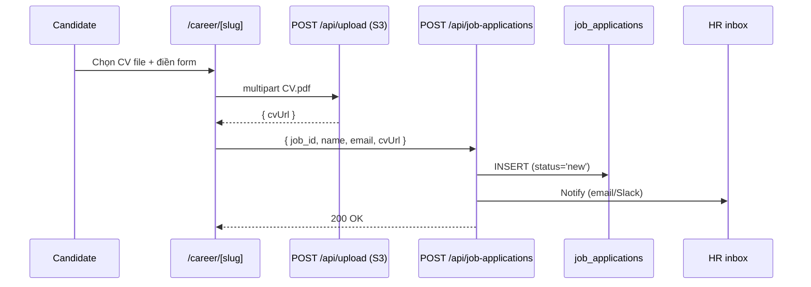
```mermaid
sequenceDiagram
    participant U as Candidate
    participant Page as /career/[slug]
    participant Up as POST /api/upload (S3)
    participant API as POST /api/job-applications
    participant DB as job_applications
    participant HR as HR inbox

    U->>Page: Chọn CV file + điền form
    Page->>Up: multipart CV.pdf
    Up-->>Page: { cvUrl }
    Page->>API: { job_id, name, email, cvUrl }
    API->>DB: INSERT (status='new')
    API->>HR: Notify (email/Slack)
    API-->>Page: 200 OK
```

### 5.3 Admin edit Product → public revalidate

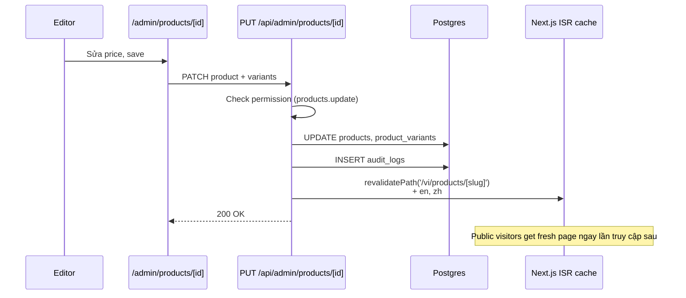
```mermaid
sequenceDiagram
    participant E as Editor
    participant UI as /admin/products/[id]
    participant API as PUT /api/admin/products/[id]
    participant DB as Postgres
    participant Cache as Next.js ISR cache

    E->>UI: Sửa price, save
    UI->>API: PATCH product + variants
    API->>API: Check permission (products.update)
    API->>DB: UPDATE products, product_variants
    API->>DB: INSERT audit_logs
    API->>Cache: revalidatePath('/vi/products/[slug]')<br/>+ en, zh
    API-->>UI: 200 OK
    Note over Cache: Public visitors get fresh page ngay lần truy cập sau
```

---

## 6. Tổng kết — bảng bao phủ trang nào

| Bảng                      | Public page sử dụng                          | Admin page quản lý       |
| ------------------------- | -------------------------------------------- | ------------------------ |
| `pages`                   | home, about, products, career, contact       | `/admin/pages`           |
| `page_sections`           | tất cả page                                  | `/admin/pages/[key]`     |
| `product_categories`      | /products                                    | `/admin/products`        |
| `products`                | /, /products, /products/[slug]               | `/admin/products`        |
| `product_variants`        | /products/[slug]                             | `/admin/products/[id]`   |
| `product_applications`    | /products/[slug]                             | `/admin/products/[id]`   |
| `product_packagings`      | /products/[slug]                             | `/admin/products/[id]`   |
| `product_specs`           | /products/[slug]                             | `/admin/products/[id]`   |
| `timeline_events`         | /about                                       | `/admin/pages/about`     |
| `certifications`          | /, /about                                    | `/admin/pages`           |
| `core_values`             | /, /about, /career                           | `/admin/pages`           |
| `stats`                   | /, /about, /products                         | `/admin/pages`           |
| `news_categories`         | /news                                        | `/admin/news`            |
| `articles`                | /news, /news/[slug]                          | `/admin/news`            |
| `departments`             | /career                                      | `/admin/jobs`            |
| `jobs`                    | /career, /career/[slug]                      | `/admin/jobs`            |
| `job_applications`        | (form submit)                                | `/admin/jobs/[id]`       |
| `contacts`                | (form submit nhiều nơi)                      | `/admin/contacts`        |
| `contact_notes`           | —                                            | `/admin/contacts/[id]`   |
| `media`, `media_folders`  | (ảnh / file gắn vào product, article)        | `/admin/media`           |
| `menus`, `menu_items`     | header & footer của mọi page                 | `/admin/menu`            |
| `chat_sessions`, `chat_messages` | widget chat ở public                  | `/admin/livechat`        |
| `settings`                | header/footer/contact info ở mọi page        | `/admin/settings`, `/admin/seo` |
| `languages`               | language switcher                            | `/admin/i18n`            |
| `translations`            | UI strings không thuộc bảng nội dung          | `/admin/i18n`            |
| `users`                   | (admin login)                                | `/admin/roles`           |
| `roles`                   | (middleware kiểm permission)                  | `/admin/roles`           |
| `audit_logs`              | —                                            | `/admin/dashboard` (xem) |

---

## 7. Quy ước đặt tên API

- Public read: `GET /api/<resource>` (list) hoặc `GET /api/<resource>/[slug]` (detail)
- Public write: `POST /api/<resource>` (form submit — kèm rate-limit & captcha nếu cần)
- Admin: tất cả nằm dưới `/api/admin/*`, yêu cầu JWT + permission check
- Query string locale qua header `Accept-Language` hoặc path `[locale]/`

Mọi response trả `i18n` đã filter theo locale yêu cầu (chỉ trả 1 ngôn ngữ về
public; admin trả cả 3 ngôn ngữ để sửa).
